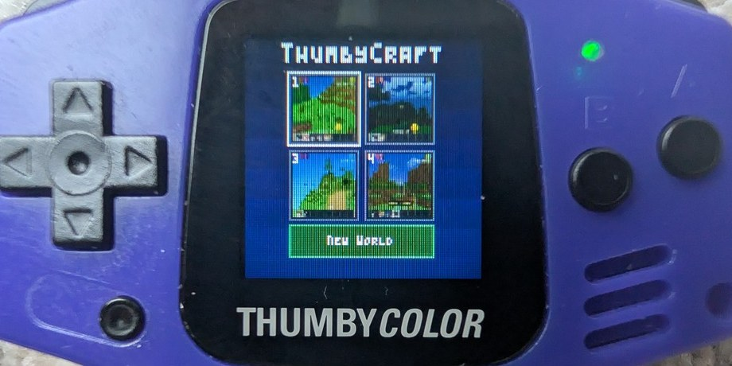
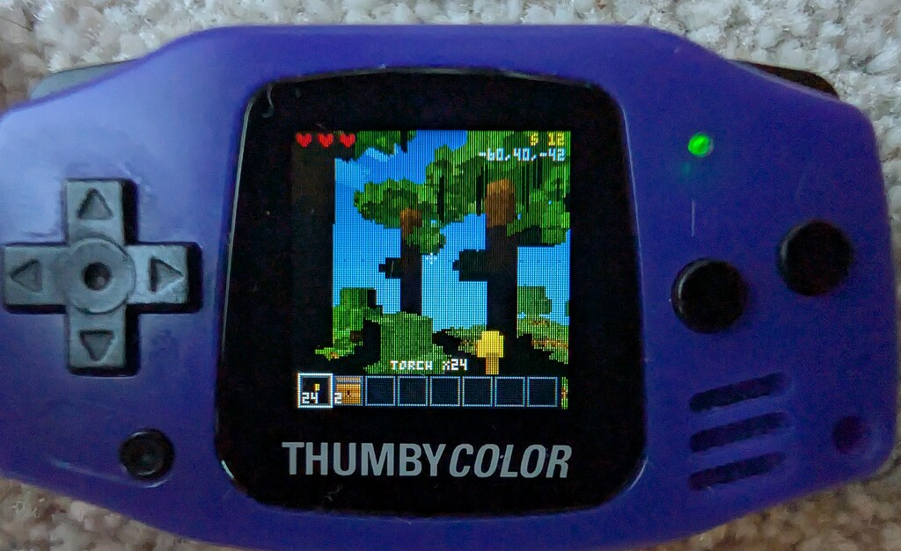
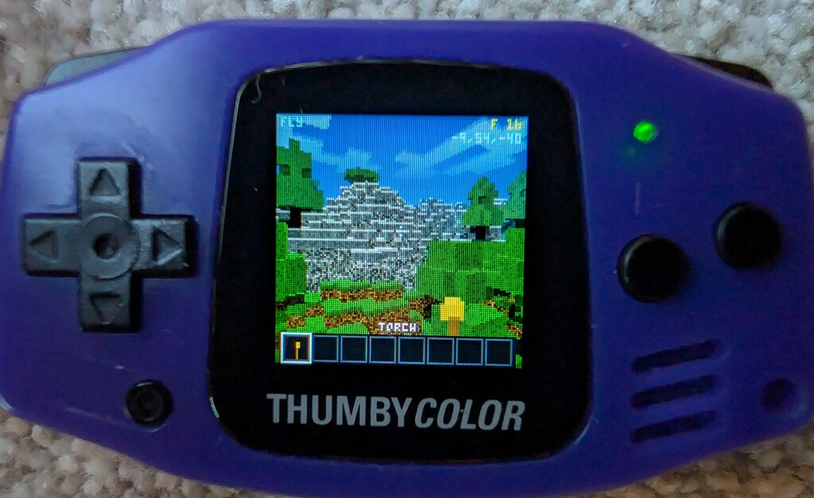
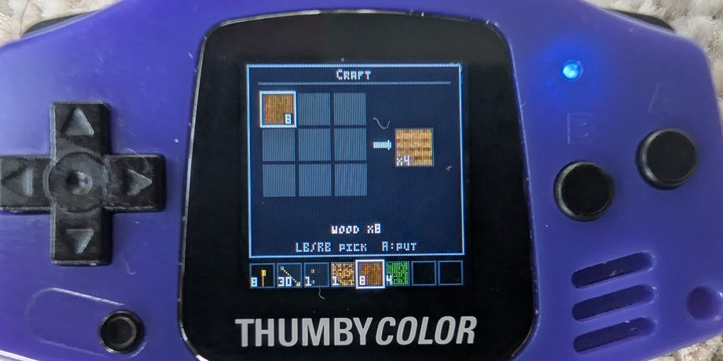
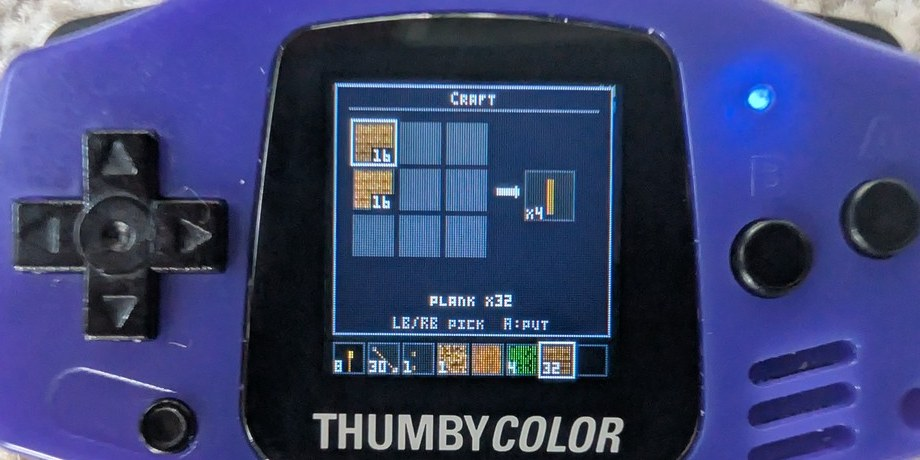
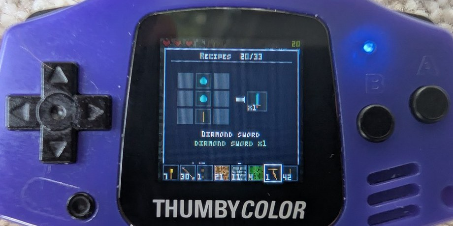

# ThumbyCraft

A bare-metal Minecraft-style voxel game for the
[Thumby Color](https://thumby.us/) — a tiny handheld with a
128×128 RGB565 screen, dual-core ARM Cortex-M33, **no GPU**, and 512 KB
of SRAM. Everything you see is rendered by per-pixel CPU raycasting in
real time, with full survival mechanics, mobs, music, and persistent
worlds.

<p align="center">
  
</p>

<p align="center">
  
  
  
</p>

<p align="center">
  
  
  
</p>

<p align="center">
  
  <br><em>Cave lava — animated, light-casting, and lethal.</em>
</p>

```
~30 fps  ·  64³ block window over an infinite world  ·  5 hostile + 3 passive mob types
8 climate biomes (plains/forest/desert/taiga/swamp/mountains/jungle/savanna) with tinted foliage
desert temples + ziggurats with baked redstone arrow traps and high-tier loot
cave lava (light source + animated + lethal) · water+lava → obsidian · gravel → flint · lit portals
redstone circuits, TNT, dispensers, observers, pistons, doors, ladders, trapdoors · giant boss spider
furnaces + chests with rarity-tiered loot  ·  full chest + furnace persistence across saves
6 control schemes incl. d-pad-walk + double-tap-hold reverse  ·  4-slot save + screenshot picker
Debussy Clair de Lune soundtrack — random key each loop, pitch sliding toward bright in caves
drifting clouds  ·  flash-backed worlds  ·  280 MHz dual-core M33 tile-stealing raycaster
```

---

## What's new in 1.17

> ℹ️ **Saves carry over.** The save format is unchanged (the loader
> still dual-reads every version back to v5), so your existing worlds
> load with all your edits intact — and because the world is stored as
> a diff over the generator, the new dungeons, forts and foliage appear
> in your world as the terrain around you regenerates.

A **biome-detail, structures & dungeons** release — the world is denser
and there's somewhere to delve.

**Cutout foliage & sprites.**
- The raycaster now renders plants, vines, ladders, doors, trapdoors,
  pressure pads and redstone wire as **see-through cutout textures**
  inside the DDA itself, instead of post-pass cuboids — crisper and
  cheaper. A **closed door blocks the ray** (it stops at the slab),
  saving all the work behind it.
- **Doors look like doors** — framed wooden doors with stiles, rails and
  a recessed panel (two cells stack into a 2-panel door); redstone-wire
  dust is thinner and cleaner.
- **See-through "fancy leaves"** — tree canopies have airy gaps you can
  see sky/terrain through.
- **Natural flowers** (tulip + daisy silhouettes, not lollipops),
  retuned per-biome foliage greens, and **tinted grass sides**.
- **Tall-grass tufts** come in three styles — light-tipped blades,
  seed-heads, and shorter tufts — mixed per biome (seedy in warm/dry
  savanna & desert, solid green in cooler/damp, dark in jungle).

**Flowering jungle & blossom trees.**
- **Dangling flower vines** hang as a curtain under jungle canopies,
  with colourful blossoms (pink/red/purple/orange) along their length.
- **Blossom trees** — some warm-climate trees bloom, their leaves
  flecked pink/white/yellow/magenta over biome-tinted green.
- **Palm trees** on warm beaches.

**Forest skeleton forts.**
- A rare **stone keep + walled compound** hidden deep in the forest,
  with a loot chest in the keep. **Skeletons swarm it day and night** —
  approach with care.

**Underground roguelike dungeons.**
- Stone/cobble **dungeon complexes near the lava** — rooms of varied
  size linked by a mix of tight 1-wide and wider 2–3-wide corridors.
- **Treasure chests** with rare/legendary loot reward the delve.
- **Trapdoor hatches** — a trapdoor set in an 8-block stone surround at
  ground level caps a 1-wide well down into a room, so dungeons are
  discoverable and enterable from the surface (and light spills in).
- **Skeletons, spiders and slimes** lair down there — they spawn more
  often and more thickly underground (and never creepers in the deep).

**Other.**
- New **spawn**: you start at the world origin on the first solid ground
  below — never in a treetop or a lake.
- A **ground-cover toggle** in the pause menu hides flowers/grass; both
  flowers and tall grass are **placeable** blocks.
- Raycaster moved into **SRAM** for a steadier framerate.

---

## What's new in 1.16

A performance + polish release — the chunk-load stutter is gone, the
raycaster is meaningfully faster, and lava/ice/pistons got a pass.

**Performance.**
- **Smooth chunk loading.** Terrain now streams in column-by-column as
  you walk (in small batched runs) instead of rebuilding a whole chunk
  at once, so the periodic hitch when you cross into new area is gone.
  The music no longer clicks on the transition — it's clocked from the
  audio samples rather than the frame timer, so a long frame can't skip
  it. The trade-off is that spreading the chunk work across many frames
  costs a little peak framerate while you're moving — it used to all
  land in one stutter instead.
- **~30 % faster raycaster — which more than makes up for that.** A
  coarse terrain-height grid lets rays skip straight over the empty air
  between the camera and the first solid block instead of stepping
  through it one cell at a time (about 95 % of steps were landing on
  empty air). Biggest gain on open and long-distance views. Net result
  across the two changes: a steadier ~20 fps with no hitches, where
  before you got higher peaks but a stutter on every chunk boundary.
- **FPS counter toggle** in the pause menu (off by default).

**Lava.**
- **Flowing lava** spreads from a source up to three blocks
  (Minecraft-accurate overworld reach), oozing slowly; running it into
  water still hardens to obsidian.
- **Lava settles** into a still pool when contained, instead of
  animating and re-lighting every tick forever.
- The creative inventory no longer lists the flowing-lava levels —
  only the lava source shows, the same as water.

**Visuals.**
- **New ice** — a clean near-white cracked-plate sheet with per-block
  variety plus smooth large-scale brightness variation, replacing the
  old speckly pattern.
- **Sticky pistons** now read differently from regular pistons: a green
  slime cap in the world model and a green face in the inventory bar +
  held hand.

**Other.** Creative mode can break any block; a held torch can act as a
light source (toggle); an optional 64×64 low-res perf mode; "New world"
moved to the bottom of the pause menu.

**1.15.1 (fixes):**

- Fixed a big framerate drop caused by redstone blocks (observers,
  dispensers, repeaters, lamps, note blocks) — the sim no longer scans
  the whole world every tick.
- Redstone, torches and doors no longer vanish in built-up or
  vine-heavy areas; decorative vines now give way to functional blocks.
- Dispenser/temple arrow traps now damage the player (arrows hit any
  target — player or mob).
- Redstone lamps light up and cast light when powered.
- Repeaters show a sliding marker for their delay setting (1–4).
- Note blocks play a cleaner, longer tone; ice redrawn (cracked blue);
  lily pads removed.

## What's new in 1.15

The biggest content drop since launch — a full climate-biome overworld
plus the lava → obsidian → portal chain.

**Biomes.** The world is now split into eight climate biomes driven by
a temperature × humidity map: **plains, forest, desert, taiga, swamp,
mountains, jungle, savanna**. Grass and leaves are tinted per biome
(murky swamp greens, cold taiga blue-greens, golden savanna), and each
biome grows its own flora — oak/birch, snowy conifers, giant swamp
trees with hanging vines, jungle "mini-giants", flat-topped acacias,
cactus, lily pads. New blocks: snow, sandstone, cactus, vine, lily pad,
snowy rock.

**Mountains & tundra.** Mountains rise into bare rock and an
altitude-driven **snow line** whose height tracks temperature, so cold
peaks cap in snow that blends down into neighbouring tundra. Tundra
lakes **freeze over** — a walkable sheet of ice with water preserved
beneath, snowy beaches at the waterline.

**Desert temples.** Sandstone **stepped pyramids** and **walled
ziggurats** spawn in the desert (rarely as jungle pyramids), each
hiding a treasure room rigged with **baked-in redstone arrow traps** —
pressure pads around the chest and an observer that fires a volley the
moment you open the door — guarding high-tier loot.

**Lava, obsidian & portals.**
- **Cave lava** pools in the deep caverns and in **magma pockets** sealed
  in mountain rock. It's animated (a churning cracked-basalt texture),
  **casts light** like a torch, and **burns** — stay in it and you die.
- Flow **water onto lava to make obsidian** (diamond-pickaxe only).
- Mine **gravel** (new) for a chance at **flint**, then strike flint on
  an obsidian frame to **light a portal** — a swirling purple gateway
  (teleport destination coming in a later release).

**Redstone wave 2.** Dispensers (fire arrows on a pulse), targets
(emit when arrow-struck), observers, note blocks, lamps, NOT-gates and
repeaters; slime blocks (bounce) crafted from slimeball drops; the
piston split into regular + sticky. **Mobs now trigger pressure pads**,
and pads seed wire networks.

> ℹ️ **Saves carry over.** The save format dual-reads every version
> back to v5, so existing worlds load — new terrain (biomes, lava,
> ores) appears as you explore into freshly generated chunks.

---

## Quick start

A **prebuilt firmware** ships with the repo at the root —
`firmware_thumbycraft.uf2`. To play:

1. Hold **D-pad DOWN** while powering on the Thumby Color to enter
   BOOTSEL mode — it appears as a USB drive `RPI-RP2350`
2. Drag `firmware_thumbycraft.uf2` onto the drive
3. Power-cycle. You'll see a title screen with up to 4 save slots
   (showing the screenshot of each saved world) plus a "New World"
   tile. Pick one and you're in.

To build from source, see [Build](#build) below.

For fast iteration on a desktop, see **[Host build](#host-build)** below.

---

# Player guide

## Game modes

- **Survival** (default) — HP, mob threats, mine ore to upgrade tools.
  Three hearts (quarter-resolution); passive regen 5 seconds after
  damage.
- **Creative** — flight, no damage, all blocks free in inventory. Pause
  menu → *Game mode* toggle, or **MENU + A** for fly toggle.

## Controls

The pause menu's **Controls** entry now opens a **scheme picker** —
four input layouts that all share the same A / B / MENU bindings,
they differ only in how the D-pad and LB/RB are wired.  Picked scheme
persists per save slot.

**Classic** (the default — what the original ThumbyCraft shipped with):

| Button | Action |
|---|---|
| **LB** held | Walk forward (gravity on); ascend (fly mode) |
| **LB** double-tap-then-hold | Walk **backwards** (release-and-repress within 300 ms, hold the 2nd press) |
| **RB** tap | Jump |
| **D-pad L/R** | Turn left / right |
| **D-pad U/D** | Pitch camera up / down |
| **A** | Break block / attack mob / draw bow (hold) |
| **B** | Place selected block / interact (toggle door / lever / chest / furnace) |
| **MENU + LB / RB** | Hotbar previous / next slot |
| **MENU + A** | Toggle fly (creative only) |
| **MENU** (tap & release) | Open pause menu |

**Classic flip** — LB jumps, RB walks (double-tap-then-hold on RB
walks backwards). Everything else the same as Classic.

**Walk + strafe** — D-pad becomes the move stick.

| Button | Action |
|---|---|
| **D-pad U/D** | Walk forward / backward |
| **D-pad L/R** | Strafe left / right |
| **LB** held | Look mode — d-pad becomes turn (L/R) + pitch (U/D) while held |
| **RB** tap | Jump |

**Walk + turn** — same as Walk + strafe but L/R always turns; LB-held
overlays pitch onto U/D without changing the turn axis.

| Button | Action |
|---|---|
| **D-pad U/D** | Walk forward / backward |
| **D-pad L/R** | Turn left / right |
| **LB** held | Hold to pitch on U/D (turn stays on L/R) |
| **RB** tap | Jump |

**Auto-jump**: 1-block obstacles in front of you get stepped up
automatically (with a 350 ms cooldown so it doesn't bunny-hop you up
stairs).

**Hotbar slots clear on depletion** (survival mode only). If you place
the last torch in a slot, the slot's swatch disappears and you stop
"holding" it — picking up another torch slots back into the freed
spot. Creative slots keep their assignment.

## The world

Walk in any direction — it's infinite. A 64×64×64 window slides with
you, regenerating new terrain at the edges from a deterministic seed.
Your edits stay where you left them; walk back a kilometre and the
hole you dug is still there.

### What you'll find

- **Grassland plains** — gentle hills, lakes, occasional small streams
- **Mountain biomes** — taller peaks, stone surfaces, denser ore
- **Trees** — three species (standard oak, large oak with branches,
  pines in mountains)
- **Caves** — naturally carved into stone via 3D noise; entrances often
  visible on hillsides
- **Rivers** — narrow winding streams in lowlands, never carving
  through highlands
- **Buildings** (8 variants) — every settlement build has a
  structured roof: no plain plank boxes. Cottages are common,
  landmark structures are rare:
  - **A-Frame Lodge** (5×5) — steep plank gabled roof, wood corner
    posts, back-wall window.
  - **Hipped Cottage** (5×5) — 4-sided plank pyramid roof, twin back
    windows.
  - **Longhouse** (7×3) — long plank gabled ridge along the long
    axis.
  - **L-Hipped Cabin** (L-shaped) — single ridge running the length
    of the long wing.
  - **L-Gabled Cabin** (L-shaped) — twin ridges, one per wing,
    meeting at the inner corner.
  - **Watchtower** (3×3, 7 tall) — stone shaft with a cobble
    crenellated parapet; a torch perches on one merlon.
  - **Church** (5×5, 7 tall) — steep gabled stone-and-plank nave
    with a wood-log steeple rising 2 above and a torch belfry.
  - **Castle Keep** (7×7) — stone fortress with alternating cobble
    battlements all the way around and glass arrow slits on every
    side. Spawns only where a flat 7×7 patch is available.

  Each building hides a chest at first-touch with **rarity-tiered
  loot** (see [Chest](#chest-storage) below). Step through the
  doorway to claim it.
- **Drifting clouds** — soft procedural cloud layer scrolling slowly
  east across the sky during the day, turning orange at sunrise and
  sunset
- **Ore series** — coal, iron, silver, gold, diamond, redstone.
  Depth-gated (diamond + redstone deep), denser in mountains.

### Day & night cycle

A full cycle is **5 minutes** — skewed so day occupies 3 minutes and
night occupies 2 minutes. The sun arcs across the sky, colours shift,
and stars appear at night. Hostile mobs spawn during night or in
shadows — and **catch fire** in direct sunlight at ~1 HP / sec, with
rising flame particles. Be inside or shaded by sunrise.

**First-day grace**: on a freshly-spawned world, no hostile mobs
appear on the surface until the first sunset. (Caves still spawn them
from the start — caves are dark.) You get one full day to explore,
gather, and build a shelter before the night threats begin.

## Mining & crafting

### Tier-gated mining

| Block | Requires | Drops |
|---|---|---|
| Dirt, sand, wood, leaves | Hands | self |
| **Stone** | Wooden pickaxe or better | **Cobblestone** (vanilla rule) |
| Cobblestone, coal ore | Wooden pickaxe or better | self |
| Grass | Hands | **Dirt** (vanilla rule) |
| Iron ore, silver ore | Stone pickaxe or better | self (smelt for ingot) |
| Gold ore | Iron pickaxe or better | self (smelt for ingot) |
| Diamond ore | Iron pickaxe or better | **Diamond gem** (direct drop) |
| Redstone ore | Iron pickaxe or better | **Redstone dust** (direct drop) |
| **Storage blocks** (silver/gold/diamond/redstone) | Iron pickaxe or better | self |
| **Furnace, Chest** | Wooden pickaxe or better | self (chest contents are lost) |
| **Bedrock** (bottom-most layer y=0) | — | **Indestructible.** Pickaxes refuse with a "ting"; even TNT and creeper explosions skip these cells. |

Hit a block with **A**. If the active hotbar slot has a sword, its
tier sets your melee damage too (wood / stone / iron = 2 / 3 / 4 HP
per hit, hands = 1).

### Crafting

<p align="center">
  
  
  
</p>

Open **MENU → Craft**. You get a 3×3 shaped grid. Each grid cell
holds a **stack** with a count. Navigate with D-pad, **A** to place
the active hotbar item into the selected cell (single press = +1 to
the stack). **Double-tap A** on a cell to pull every available copy
of the held resource out of inventory and split it evenly across all
cells already holding that resource — handy when filling a 3×3
storage-block recipe. **B** clears a cell. **A on the output** crafts
once and leaves the grid populated, so repeated A presses keep
producing while every input cell has stack left. The hotbar shows
inventory counts during the craft page.

Recipes match canonical Minecraft Java where applicable:

| Output | Recipe |
|---|---|
| 4 planks | 1 wood log |
| 4 sticks | 2 planks vertical |
| Smooth stone | 4 cobble 2×2 (Thumby densify — see Furnace for vanilla) |
| **Pickaxes** (wood/stone/iron/silver/gold/diamond) | 3 head material across top + 2 sticks centre |
| **Swords** (wood/stone/iron/silver/gold/diamond) | 2 head stacked + 1 stick below |
| **Bow** | 6 sticks in MC's diagonal-with-string shape (we sub sticks for string) |
| **4 Arrows** | 1 iron ingot tip + 2 stick shafts (no flint/feathers yet) |
| 4 torches | 1 coal + 1 stick |
| **Furnace** | 8 cobblestone in a hollow 3×3 ring |
| **Chest** | 8 planks in a hollow 3×3 ring |
| **Storage block** (silver/gold/diamond/redstone) | 9 of the material in a 3×3 square |
| **Lever** | 1 stick on top of 1 cobble |
| **Redstone wire** | place redstone dust (becomes wire when placed) |
| **Trapdoor** ×2 | 6 planks in a 2×3 plate |
| **Door** | 6 planks in a 2-column slab (placed as a 2-cell-tall door) |
| **Ladder** ×3 | 7 sticks in an H pattern |
| **Pressure pad** | 2 stones side-by-side |
| **Piston** | planks roof + cobble/iron/cobble body + cobble/redstone/cobble base |
| **TNT** | 4 sand + 5 redstone (subs for vanilla gunpowder) |

The recipe book in **MENU → Recipes** shows them all visually, with
the input grid + output count side-by-side. Left/right cycles through
the full list (~33 recipes).

### Furnace (smelting)

Place a furnace (B), then aim at it and press **B again** to open the
smelt UI. Three slots:

- **Input** — any smeltable raw block
- **Fuel** — coal (80 s burn), wood / plank (15 s), stick (5 s)
- **Output** — accumulates smelted result

Navigation: **D-pad up/down** swaps the selection between INPUT and
FUEL. **D-pad left/right** swaps between INPUT and OUTPUT. **A** on
INPUT/FUEL pushes a stack (up to 8) of the active hotbar item into
the slot. **A** on OUTPUT pulls the accumulated smelted result back
into inventory (auto-assigning a free hotbar slot if none holds it).

Smelt time is **10 s per item**. The flame indicator on the left
fills proportional to remaining fuel; the arrow in the middle fills
with smelt progress. The furnace ticks while open AND closed — set
it going and come back later.

Smelt outputs:
- **Iron ore → Iron ingot**
- **Silver ore → Silver ingot**
- **Gold ore → Gold ingot**
- **Diamond ore → Diamond** (no pickaxe-tier shortcut needed if you
  somehow obtained an ore block)
- **Redstone ore → Redstone dust**
- **Sand → Glass**
- **Cobblestone → Smooth stone**

### Chest (storage)

<p align="center">
  
</p>

Place a chest, B to open. Get a 4×4 = **16-slot inventory** bound to
that specific chest. Press **A** on an empty slot to deposit your
held hotbar item; **A** on a full slot to take its contents back.
Useful for stockpiling beyond the 8 hotbar slots.

Active chest state caps at 4 simultaneously — additional placed
chests still exist as world blocks but show empty when first opened.

**Chest + furnace contents persist across saves** (v5 save format).
Whatever you stored when you saved is exactly what's there when you
load. Hut chests no longer refill with their original loot on reload
— if you cleared one out, it stays cleared.

**Hut chest loot** rolls one of four **rarity tiers** on first open,
driven by an independent hash:

| Tier | Chance | Contents |
|---|---|---|
| Common     | 50% | Sticks + planks only |
| Uncommon   | 30% | Adds iron / bow + arrows / torches / wood pickaxe |
| Rare       | 15% | Adds stone tools + redstone dust + bigger stacks |
| Legendary  |  5% | Adds iron tools + gold ingots + ~50% diamond |

Building visual type doesn't drive the loot tier — a plain plank
cabin can hide a legendary chest and a stone house can be near
empty. Every detour is worth checking.

### Tool & sword ladder

**Wood → Stone → Iron → Silver / Gold → Diamond.** Each tier mines
faster, hits harder, and unlocks the next block type. Iron picks
mine gold, diamond, and redstone ores — the silver and gold tiers
are cosmetic above iron's mining tier (same harvest capability,
distinct colour), while diamond is the top tier.

Sword damage per hit: wood 2 · stone 3 · iron / silver / gold 4 ·
**diamond 8** (boss-killer).

## Combat & mobs

### Hostile

- **Slime** — basic chaser, contact damage 1
- **Skeleton** — ranged. Holds at 5 blocks, **fires arrows** with
  gravity arc and rough line-of-sight check. **Drops a bow + 2-3
  arrows** when killed.
- **Spider** — fast melee, 1.5× slime speed, contact damage 2
- **Creeper** — silent walker; entering 1.8 m range freezes it for a
  **1-second fuse** (visually pulses toward white), then it
  **explodes**: 5 damage within 2.5 m + **destroys nearby blocks**
- **Boss spider** — giant 3× spider. HP **80**, only takes damage
  from the **diamond sword** (other weapons flash the hurt animation
  but deal 0). Spawned by activating a `diamond block` with a
  redstone circuit (see Redstone section). On death it drops a
  shower of 9 diamonds and a big green **YOU WIN!** banner pops on
  screen for 5 s.

All standard hostiles only spawn **in shadow or at night** — but the
spawner now ALSO probes random dark cave air pockets (not sky-exposed,
no torch light), so cave exploration is genuinely dangerous from the
moment you enter one.

**Mob jumping**: when a hostile is blocked by a 1-block obstacle in
front of it (and there's clear space above), it hops to keep chasing
you. The boss spider gets a higher jump (clears 2-block obstacles)
because its 3× sprite needs the extra height to follow you onto
ledges.

All hostiles keep one cell of standoff distance — they bite from the
neighbour block, never enter your cell.

### Bow combat (snap auto-aim)

Once you have a bow + arrows (killed a skeleton, or crafted from
iron + sticks), put the bow on your hotbar and **hold A** to enter
draw mode:

- Yaw **auto-aims** at the nearest hostile within 16 blocks and a
  ±60° cone — the camera lerps onto the target over ~0.5 s.
- The **crosshair tracks the locked target** (turns yellow). It's
  pinned to the mob's chest, so you can see exactly where the lock is.
- **Pitch stays user-controlled** — D-pad up/down lets you aim
  vertically for arc shots over walls or to compensate for distance.
- The bow visibly **draws back** (tilts up and inward) as the draw
  charges over ~0.4 s.
- **Release A** to fire. The arrow flies in the camera-forward
  direction (yaw-locked + your pitch). The crosshair snaps back to
  centre.
- Tapping A briefly with the bow does nothing — the bow only fires
  on release.

**Arrows are recoverable**: any arrow that misses its target —
embedded in a block, expired in flight, or a skeleton's stray shot —
drops a collectable arrow item at the landing spot. Walk over it to
add it back to your inventory.

### Passive

Sheep, pigs, chickens wander grassland during the day. Currently
no drops; mob loot (wool / feather / pork) is a queued feature.

### Dropped items

Anything that lands in the world as a "floating item" — skeleton
loot, missed arrows — appears as a small spinning cube on the
ground. Walk within 1.5 m to auto-collect into inventory. Drops
expire after 90 s if uncollected.

## Redstone circuitry

<p align="center">
  
</p>

A small but functional Minecraft-style redstone implementation.
The propagation tick runs at **5 Hz** with an early-exit when no
power source exists in the resident window — zero CPU cost when
your world has no circuits.

### Sources & wire

- **Lever** — placed flat against the surface you aimed at, in any
  of the 6 cardinal orientations. B-interact toggles between OFF
  and ON; the ON state emits power into all adjacent cells. Built
  as a 3D sprite (base plate + handle + ball tip), not a flat
  texture — visually distinct on walls, ceiling, and floor.
- **Redstone block** — solid storage block AND a permanent power
  source. Adjacent wires light up while the block is in place.
  Wires can also propagate THROUGH redstone blocks, so you can use
  them as power bridges or always-on triggers.
- **Redstone wire** — placed by using **redstone dust**
  (`BLK_REDSTONE`) in the world; the dust converts to a 2D flat
  "+" sprite on the floor of the cell. Wires carry power from any
  adjacent powered cell through their network via 6-directional
  BFS. Powered wires brighten (visible colour change).
- **Pressure pad** — flat sprite on the floor. While a player or
  mob stands in the cell containing the pad, it acts as a power
  source (same as a held-down lever) — power propagates to wires
  next to it. Released when you step off.

### Driven blocks

Adjacent power drives state on:

- **Doors** — closed solid panel ↔ open thin slab against the
  hinge wall. Both halves (top + bottom) toggle together.
- **Trapdoors** — closed ceiling-height slab ↔ open vertical
  slab against an adjacent wall. Open trapdoors are passable
  (player falls through).
- **Sticky pistons** — `PISTON_OFF` ↔ `PISTON_ON` + a `PISTON_ARM`
  block in the cell facing the head. Orientation is per-placement
  (any of the 6 cardinal directions): the shaft + head point away
  from the surface you placed the piston against. The 3-part model
  (base + shaft + head) extends 1 cell when powered. If the cell in
  front is a solid block, the piston shoves it one further along
  (single-block push). On power loss, the head retracts AND drags
  the front block back with it (sticky pull). You can also place
  a block on the head face — picking respects the head's flat
  outer surface so B-placement works.
- **TNT** — `BLK_TNT` flips to `BLK_TNT_FUSED` (brighter, "primed")
  on any adjacent power. A 3-second fuse counts down in real time
  (separate from the propagation tick), then the cell explodes —
  clears a 3-block-radius spherical chunk of breakable blocks and
  chain-fires any adjacent TNT.

Doors and trapdoors **without** any adjacent redstone gear are left
alone by the propagation tick — you can manually B-toggle them in
isolation and the state persists.

### Boss circuit

Place a diamond block (storage block, 9 diamonds), run a wire next
to it, place a lever next to the wire (or somewhere connected), and
flip the lever ON. The diamond block activates exactly once and
spawns the **giant boss spider** in the cell above it. Bring a
diamond sword — nothing else damages it. ~10 hits to kill (HP 80 ÷
8 dmg per diamond-sword swing).

## Interactive blocks

| Block | Source | Behaviour |
|---|---|---|
| **Ladder** | 3 ladders per craft (7 sticks in H) | Climb when adjacent or standing in the cell + UP. Renders as 2D rails + 4 rungs against one wall (orientation tracked per-cell). |
| **Trapdoor** | 2 per craft (6 planks 2×3) | Hatch at the cell ceiling when closed (solid). Vertical slab against hinge wall when open (passable — fall through). B-interact toggles. |
| **Door** | 1 per craft (6 planks 2-column) | 2 cells tall. Auto-places top half on B. Closed is a thin solid panel; open is a thin slab against the hinge wall (passable). B-interact toggles both halves. |
| **Pressure pad** | 1 per craft (2 stones) | Acts as a held-down lever while you stand on it. |
| **Piston** | 1 per craft (cobble + iron + redstone) | Extends an arm block upward when powered (pushes the cell above one further up if it's solid). |
| **TNT** | 1 per craft (4 sand + 5 redstone dust) | Adjacent power lights the fuse (3 s), then explosion clears a 3-block radius. Chain-reacts with neighbouring TNT. |

All small-shape blocks (ladder, door, trapdoor, pressure pad,
lever, redstone wire, piston) render via the same multi-cuboid
sprite system the torches use — picker raycasts directly against
the cuboids so B-interact and head-face placement work even when
the cell is non-opaque.

## Lighting & torches

The world has a **gradient lightmap** flood-filled from each torch.
Caves are dark — you'll need torches to see. Place a torch with **B**
when holding one (start with 8 in survival inventory) and the area
brightens in a smooth radial falloff.

Torches mount automatically based on the surface you place them on:

- On a wall → mount horizontally outward
- On the floor → stand vertically

Outdoor brightness tracks the sun: full daylight at noon, dim
moonlight at midnight. Under a tree at noon, you'll see a softer
shadow that fades correctly with the day cycle.

## Building & persistence

Every block you place or break is held in an SRAM mod hash keyed by
world coords. Persistence to flash happens on **save** — either
manual via **MENU → Save world**, or automatic per the **Auto save**
menu setting (default: on events).

**Everything in your session persists across save/load**: chunk
edits (block changes), chest contents (up to 4 active chests × 16
slots), furnace state (input / fuel / output with smelt progress
and fuel timer preserved), control scheme, and auto-save mode.
Save format is v5; v4 saves from earlier builds no longer load.

**4-slot picker** for both Save and Load. Each slot shows a 32×32
thumbnail of the last in-game frame before you opened the pause
menu (captured at save time). Pick a slot to commit / load; empty
slots show "Empty"; B cancels.

### Auto save

<p align="center">
  
</p>

**MENU → Auto save** cycles through four modes (A to advance):

- **Off** — manual save only. The SRAM mod hash holds up to 2048
  edits and the dirty queue holds 32 distinct chunks; if you
  somehow fill the queue without saving, the oldest chunk
  force-flushes synchronously so progress never gets dropped.
  Power-cut between saves still loses everything since the last
  Save action though.
- **60s** — full save every 60 seconds.
- **Idle** — full save after 5 seconds of no input *and* no
  walking. Hides the save hitch behind a natural pause.
- **Event** (default) — full save when you open the pause menu,
  close it again (catches chest / inventory / craft / etc.), and
  when the sun crosses the horizon. Saves at natural pause points
  rather than introducing new ones.

Auto save only ticks while you're on a saved slot. A brand-new
world (after **New world** but before any **Save**) lives in a
scratch region and won't auto-save until you explicitly commit it
to slot 1-4.

### Per-world storage (standalone vs ThumbyOne slot)

- **Standalone** firmware: chunks live in flash sectors keyed by
  hash, one 1 MB region per save slot.
- **ThumbyOne slot mode**: chunks are files under
  `/thumbycraft/<region>/<cx>_<cz>.cnk` on the shared FAT. One file
  per edited chunk; an unedited world consumes essentially zero
  disk. You can back the whole `/thumbycraft/` tree off via USB
  MSC to copy worlds between devices or to your PC.

### Title screen

Power on → **title screen** before the game loop starts:

- "ThumbyCraft" header + a 2×2 grid of the 4 save slots (showing the
  saved screenshot thumbnails) + a "New World" tile beneath.
- D-pad navigates, A confirms. Picking a used slot loads it directly
  into the game; "New World" spawns a fresh random seed; empty slots
  reject A (you'd have nothing to load).

### New world

**MENU → New world** generates a fresh seed and rebuilds. Carefully
clears in-SRAM state (mods, chests, furnaces, water, drops,
particles) AND re-keys the chunk store, so nothing leaks from the
previous world. Survival/Creative mode, Invert-Y, and music
preferences carry over.

## Inventory page

**MENU → Inventory** opens a scrollable grid showing **every** item
you own (mined, crafted, picked up). D-pad navigates, **A** assigns
the selected item to the **currently-active hotbar slot**. **LB/RB**
cycle which hotbar slot is the assign target — the always-visible
bottom hotbar shows the highlight in real time. Useful for swapping
in tools mid-game.

## Held item view

The currently-held hotbar item shows in a small **3D viewport in the
bottom-right** of the screen — picks, swords, bow, arrow, or a tilted
cube for any held block. Swings forward on **A press** (mine or
attack), giving you visual feedback for combat and mining.

## Music

The soundtrack is **Debussy's *Clair de Lune*** played as a real MIDI
timeline through the in-game synth, with a few twists for variety so
you don't hear the exact same pass twice:

- **Random starting point** on every game start / world load — the
  cursor seeks to a uniformly random position in the loop.
- **Random direction per loop**: a coin flip at each loop wrap
  decides whether the next pass plays forwards or **backwards** (note
  events fire in mirrored temporal order — same melody, retrograde).
- **Random key transposition**: each loop also chooses a new
  semitone shift. The whole piece is replayed in that key.
- **Altitude follows the pitch**: deep underground biases the music
  bright/high (crystalline), mountaintops bias it deep/low. The
  current key glides smoothly toward the altitude target so
  climbing or descending warps the music over a few seconds.
- Music volume + SFX volume are independent sliders in **MENU**
  (0–100% in 10% steps). Music defaults to **50%** — full volume
  with reverb tails is loud. You can also fully disable music.

## Tips

- **You get a free first day.** No surface hostiles until the first
  sunset. Use it to mine stone + cobble, craft a pick, get a furnace
  going, build a shelter. Don't burn it on aimless wandering.
- **Mine stone first.** Stone drops cobble — you need cobble for the
  furnace and stone pick.
- **Skeletons are your bow supplier.** Kill one and pick up the
  drops. Then **hold A** with the bow held — auto-aim takes over,
  release to fire.
- **Recover your arrows.** Missed shots aren't lost — walk to where
  they landed.
- **Light caves before exploring.** Hostiles spawn in unlit cave
  cells day or night.
- **Build a small shelter before sunset.** A 5×5 plank box with a
  torch + a door + torches buys you safety until dawn — or find a hut.
- **Creepers respect water.** Drop into a pond if one's fuse is
  counting — explosions skip water cells.
- **Fall damage starts at 10 blocks.** Drops up to 10 cells are free;
  beyond that, 1 HP per block, capped at 20.
- **Use ladders to climb out of mineshafts.** Place against any wall,
  step into the cell, then **hold LB** to climb. Pitch direction
  decides up vs down (look up to ascend, look down to descend).
  Climb engages only while LB is held — release to step off
  horizontally or fall freely. Reaching the ground while descending
  latches a lockout so the ladder won't immediately re-grab you;
  release LB + represss with upward pitch to re-engage.
- **Redstone shopping list:** 1 lever or pressure pad (source) + a
  line of redstone dust (becomes wire when placed) + the thing you
  want to drive (door, trapdoor, piston, TNT, or a diamond block).
- **TNT chain-reacts.** Two TNT blocks side by side detonate one
  after the other from the same trigger.
- **Boss spider only takes diamond damage.** Bring a diamond sword
  before activating the diamond-block circuit, or the boss eats you.
- **Chests beyond the first 4 in your area are empty.** Stick to a
  small storage hub rather than scattering chests across the map.

---

# Technical architecture

This is a CPU-only voxel renderer. There is no GPU on the RP2350; every
pixel drawn to the screen passes through one of the M33 cores.

## Hardware target

- **MCU**: Raspberry Pi RP2350 (dual ARM Cortex-M33 @ 280 MHz, FPU,
  no GPU)
- **SRAM**: 512 KB main + 8 KB scratch X/Y (used for stacks)
- **Flash**: 2 MB (XIP execute-in-place; cached)
- **Display**: GC9107 LCD, 128×128 RGB565, SPI + DMA
- **Audio**: PWM on a single GPIO with IRQ ring buffer, 22050 Hz
- **Input**: GPIO buttons (A, B, LB, RB, D-pad, MENU)

## Memory map (SRAM)

| Item | Size |
|---|---|
| `craft_world_blocks` — resident 64³ window | 256 KB |
| `craft_world_lightmap` — 2-bit gradient | 64 KB |
| `s_mods` — player-edit hash | 24 KB |
| `craft_zbuf` — per-pixel depth | 16 KB |
| `g_fb` — framebuffer | 32 KB |
| `craft_world_skyheight` — per-column sky Y | 4 KB |
| `audio ring + reverb` | 12 KB |
| Mob models, particle pool, torch list, drops, mod buffers | ~12 KB |
| Furnace state (×8) + chest state (×4) | ~1 KB |
| Pico SDK BSS + heap + multicore lockout | ~32 KB |
| **Total resident** | **~456 KB / 512 KB** |

Stacks (core 0 + core 1, 4 KB each) live in scratch X/Y, so they
don't count against main SRAM.

## Rendering: per-pixel DDA raycaster

The core renderer (`src/craft_render.c`) walks one ray per pixel
through the voxel grid using a **3D DDA**:

```
for each pixel (px, py) in 128×128:
    dir = camera_basis(px, py)
    voxel = floor(camera_pos)
    while step_count < 64:
        if t_max_x is smallest: voxel.x += sign(dir.x); idx += signx
        elif t_max_y:           voxel.y += sign(dir.y); idx += signy * WORLD_X * WORLD_Z
        else:                   voxel.z += sign(dir.z); idx += signz * WORLD_X
        if voxel exits window: break
        block = craft_world_blocks[idx]   // direct array read, no fn call
        if block is solid: hit; sample texture; shade; write fb + zbuf; break
```

Key optimisations:

- **Per-frame column basis cache** (`s_col_basis[128]`) — ray direction
  for each screen X is computed once and reused for both top and
  bottom strips
- **Incremental world index** — the local-buffer index is maintained
  by adding ±1 / ±64 / ±4096 per DDA step instead of recomputing from
  voxel coords. Eliminates a function call + bounds compare + multiply
  per step.
- **`.time_critical` SRAM placement** — the hot trace function is
  marked `__attribute__((section(".time_critical.craft")))` so it
  runs from SRAM, not XIP flash (no instruction-cache misses)
- **`-O3 -ffast-math -mfpu=fpv5-sp-d16`** — single-precision FPU,
  aggressive optimisation

### Dual-core split — tile work-stealing

`device/craft_device_main.c` launches core 1 in a render loop and
both cores draw the frame as a **tile work-stealing** pool, not a
fixed top/bottom split.

The 128-row screen is sliced into **16 tiles of 8 rows each**. A
single `volatile uint32_t` tile counter sits in shared memory; each
core grabs the next tile via `__atomic_fetch_add` and renders it,
looping until the counter exhausts. Whichever core finishes its
current tile first claims the next one. Self-balancing under any
view direction — sky-heavy strips finish faster than texture- or
mob-heavy strips, so the slow core's neighbour quietly steals more
tiles instead of sitting idle waiting on a half-frame barrier.

A static 50/50 split bled ~6 ms per frame whenever one half was
visually busier than the other (looking straight down at terrain
vs. straight up at sky). The work-stealing pool drops the worst-case
load mismatch to one tile (~6 % of a frame).

Each frame:

1. **Phase 1** — input + physics + auto-save tick (core 0 only).
2. **Phase 2a** — compute the per-frame camera basis on core 0
   (sole writer of the shared basis cache, can't race core 1).
3. **Phase 2b** — reset `s_next_tile` to 0, set the `c1_run` flag.
   Both cores enter `run_tiles()` and atomic-CAS their way through
   the 16 tiles. Core 0 returns when the counter exceeds 15; it
   then spins on `c1_done` until core 1 signals it's also out.
4. **Phase 3** — HUD overlay (core 0 only, after both cores quiesce
   — the hotbar straddles the tile seams).
5. **Phase 4** — DMA blit the framebuffer to the LCD; while the
   pixel DMA is in flight, the next frame's Phase 1 already runs.

Tile size of 8 rows is the sweet spot: per-tile cost is ≈ 1 024
pixels × a few μs ≈ 3–5 ms — multiple orders of magnitude larger
than the ~50 ns atomic-add overhead, so dispatch cost is invisible.

Core 1 also registers as a `multicore_lockout_victim_init()` ACK
target during startup, so the chunk store's flash writes can halt
it cleanly for the erase/program window without the render loop
fighting for XIP.

## World system

### Sliding window

The world is conceptually **infinite** in X/Z, bounded 0..63 in Y. A
64×64×64 buffer (`craft_world_blocks`) is the resident **window**
into that infinite world, tracked by `(origin_x, origin_z)`. When the
player walks within 16 cells of an edge, `craft_world_maybe_shift`:

1. Persists chunks leaving the window to flash (see chunk store)
2. `memmove`s the overlap regions of the buffer
3. Generates the new strip from the deterministic seed
4. Restores chunks entering the window from flash

A single-axis 16-cell shift regenerates only 1024 columns of new
terrain (~7 ms), keeping the frame budget intact.

### Terrain generation (`src/craft_gen.c`)

Pure functions of `(x, y, z, seed)` so the save layer can reconstruct
the base world without holding a second copy:

- **Heightmap**: 4-octave FBM 2D value noise → base elevation
- **Mountain biome**: low-frequency biome noise; ramps add up to
  22 blocks of extra elevation
- **Rivers**: ridge noise (peaks where FBM crosses 0.5); gated by
  natural elevation ≤ water_level + 2 so streams only form in
  lowlands, never canyon through hills
- **Caves**: 3D value noise (stretched Y for horizontal chambers);
  carves stone below dirt + above bedrock; ~5-15 % cell coverage
- **Trees**: three shapes (oak, branched large oak, pine), placed by
  per-position hash, with biome-aware density
- **Huts**: 5×5 plank cabins in flat lowland grass, ~1 per 128×128
  area, with deterministic door orientation

The column generator `craft_gen_column` produces an entire Y stack
for one (x, z) per call, used by the window-load and window-shift
paths. The per-cell `craft_gen_block_at` produces the same answer for
any single coordinate, used by the save diff.

### Lighting (`src/craft_world.c`)

- **2-bit gradient lightmap** (64 KB, 4 levels per cell). Flood-filled
  via BFS from each torch within radius 6, levels decay with distance
- **Per-column sky-height** (4 KB). The Y of the topmost solid block
  per (x, z) column. Lets the renderer distinguish sky-exposed cells
  from cave cells in O(1)
- **Shadow tiers**: in the renderer, the effective brightness for an
  air cell is computed from its column depth below sky:
  - depth ≤ 0: full daylight × current sun factor
  - 1-2: 70 % (tree shadow)
  - 3-5: 50 % (under canopy floor)
  - 6-9: 27 % (upper cave)
  - 10+: deep-cave constant ~16 % (day/night independent)
  - Plus a 3×3 sky-neighbour lift for cave-mouth cells
- **Torch overlay**: lightmap level (1-3) floors the brightness so
  torches glow even in deep caves

### Chunk store — per-world regions, nonce-filtered

The world's edits are persisted as a key/value store keyed by
`(chunk_x, chunk_z)` → list of `ChunkMod{lx, y, lz, blk}` records.
Each save slot owns its own physical region; the regions never
overlap. Two backend implementations share one API:

| Build | File | Backend |
|---|---|---|
| Standalone device | `device/craft_chunk_store_flash.c` | direct flash sectors |
| ThumbyOne slot    | `device/craft_chunk_store_fatfs.c` | files on the shared FAT |
| Host (SDL2)       | `host/craft_chunk_store_stub.c`    | no-op stub |

Both backends use the same nonce trick: the store is **bound** to
`(region, nonce)` at a time; reads/writes only touch sectors or
files stamped with the matching nonce.

**Standalone (raw flash).** Each region is 1 MB = 256 sectors of
4 KB, hash-addressed by `(cx, cz)` with up to 8-slot linear probe
on collision. Five regions total (4 save slots + 1 scratch) = 5 MB
reserved on the standalone build:

```
0x100000..0x1FFFFF   slot 0 region   (1 MB, 256 sectors)
0x200000..0x2FFFFF   slot 1 region
0x300000..0x3FFFFF   slot 2 region
0x400000..0x4FFFFF   slot 3 region
0x500000..0x5FFFFF   scratch region  (unsaved new worlds)
```

Sector format:

```
magic     'TCM4'   · 4 B   (bumped from v1 'TCMK')
nonce              · 4 B   — region-binding nonce
chunk_x, chunk_z   · 4 B + 4 B
mod_count          · 2 B + 2 B pad
mods               · 4 B each (lx, y, lz, blk)  — up to 340
crc32              · 4 B
padding to sector boundary (0xFF)
```

A sector counts as "free for probe" if its magic is invalid **or
its nonce doesn't match the bound nonce** — stale sectors look
identical to empty ones, so they get overwritten by the next save
that hashes to that slot.

**Why the nonce.** Without it, every new-world action would need
to physically erase the region (~3 s of flash erase for 1 MB).
Instead the scratch region carries an in-RAM `uint32_t` nonce
that's re-randomised on every new-world; slots carry their save's
freshly-bumped seq number as their nonce. Old sectors stay
physically present but become invisible, and the next save into
the same hash slot just erase+programs over them. New-world is
~1 ms instead of ~3 s.

**Slot mode (FatFs).** Storage moves to one file per chunk under
the shared FAT volume:

```
/thumbycraft/scratch/<cx>_<cz>.cnk
/thumbycraft/slot0/<cx>_<cz>.cnk  ...  /thumbycraft/slot3/<cx>_<cz>.cnk
```

The filesystem is the lookup table — no hash + probe. The original
plan was one file per region with hash-indexed sectors, but FatFs
has no sparse-file support: `f_lseek` past EOF + `f_write` forces
it to allocate every cluster up to the write position, so a single
chunk written at hash slot 200 would balloon to 800 KB of allocated
clusters. One file per chunk gives genuinely-lazy allocation —
each chunk costs one 4 KB cluster regardless of its `(cx, cz)`
magnitude. Multiple worlds coexist; backing up `/thumbycraft/` over
USB MSC just copies the files.

The same magic + nonce + mod-list bytes live in each `.cnk` file,
so the nonce-filter trick still works — `bind(region, nonce)` sets
the active nonce, and reads of stale files (e.g. left over from a
previous scratch session) get silently dropped.

A **32-byte (256-bit) bloom-style bitmap** is rebuilt on every
`bind()` by scanning the region's directory. `load(cx, cz)` checks
the bitmap before calling `f_open`, skipping the ~2 ms `FR_NO_FILE`
round-trip on the >90 % of chunks that have never been edited.
False positives just cost one redundant `f_open` and the directory
scan dominates the total bind time anyway.

**Save flow.** On window shift, chunks leaving the window get
their mods scanned out of the SRAM mod-hash and persisted; chunks
entering have their mods loaded back into the hash so the gen pass
picks them up. Standalone runs a background drain timer
(`PERSIST_PERIOD = 2 s`) so the cost of evicting chunks spreads
into single-sector hitches rather than bundling on every shift.
Slot mode disables the background drain — each FatFs write costs
~30-50 ms with all IRQs masked, which would click the audio PWM —
and instead flushes the full dirty queue synchronously on every
manual or auto save. The 32-entry dirty queue still force-flushes
its oldest entry on overflow, so an unsaved walk-forever session
can't lose data, just stutter briefly when the overflow fires.

**Flash safety.** Erase + program calls
`multicore_lockout_start_blocking()` so core 1's render loop is
parked during the ~10 ms XIP-disable window. Core 1 calls
`multicore_lockout_victim_init()` at startup to register the SIO
FIFO IRQ handler that ACKs the lockout.

## Mobs (`src/craft_mobs.c`)

Each mob is a **multi-cuboid model**. The render path projects the
mob's world AABB to a screen bbox, then per pixel inside that bbox
casts a ray into the mob's local frame and tests against every
cuboid part using slab intersection. The nearest hit defines the
colour + face for shading. Parts are sorted by volume at build time
so the big body cuboids hit first, tightening `best_t` for the small
detail cubes (eyes, mouth, ribs, mottling).

### Hostile AI

- **Slime**: chase + melee at standoff
- **Skeleton**: chase, hold at 5 m, back off at 3 m; line-of-sight
  test (stepped block-raycast); fires arrows with gravity-leading aim
- **Spider**: fast chase + melee
- **Creeper**: chase until 1.8 m; freeze + visual fuse 1 s; spherical
  block destruction within 2.5 m + particle blast

### Arrow projectiles

16-arrow pool, gravity -8 m/s², AABB-block hits, AABB-player hits, 3-s
lifetime cap. Rendered as a brown-shaft + white-tip line via
Bresenham with per-pixel z-buffer test.

### Mob spawn rules

Hostiles only spawn where cells are **either not sky-exposed**
(under cover) **or it's currently night**. Caught in direct sunlight
they take 1 HP / sec and emit rising flame particles via
`craft_particles_emit_flame`.

## Audio (`src/craft_audio.c`)

A 4-voice procedural synth running entirely in the audio IRQ:

- **Voices**: 4 total (0 = pad chord, 1 = melody, 2-3 = SFX). Each
  voice supports up to 4 oscillators with one shared envelope, so
  the pad plays a full 4-note chord through one ADSR.
- **Waveforms**: sine (256-entry table + linear interp), square,
  triangle, noise
- **Envelope**: exponential ADSR
- **Reverb**: single comb-delay (~93 ms, wet 0.28, feedback 0.22)

### Music (actual Debussy *Clair de Lune* MIDI playback)

The music is no longer procedural — it's an honest-to-goodness
playback of the real Debussy *Clair de Lune* MIDI, converted to a
915-event timeline at build time by `tools/cdl_to_c.py` and embedded
in flash as `cdl_seq[]`. The runtime engine just walks the timeline
and triggers a 6-voice polyphonic synth pool per event.

- **Voice pool**: 6 simultaneous sine-tone voices for music (each
  with its own ADSR), 2 reserved for SFX. The note scheduler picks
  the oldest released voice on each new trigger so trailing release
  tails keep ringing under fresh notes (substitute for a sustain
  pedal).
- **Random start point** on game start / world load — the playback
  cursor seeks to a uniformly random offset within the loop so the
  same world doesn't always open on the same bar.
- **Random forwards / reverse direction per loop wrap** — each pass
  through the timeline is a coin flip; reverse plays events in
  mirrored temporal order (`period − t`).
- **Altitude-driven pitch**: a target semitone shift slides
  continuously based on player Y — deep underground reads as bright
  / crystal (~+15 semitones above the source key), mountaintops as
  deep / calm (~+5). Pitch glides toward the target over a couple
  of seconds, so climbing or descending warps the music smoothly
  instead of jumping.
- **Slow random walk** at each loop wrap adds ±1 semitone of
  variation around the altitude band so even standing still produces
  subtle variety pass-to-pass.
- **Tools shipped in repo**: `tools/cdl_to_c.py` and the source
  MIDI live in the tree so you can regenerate the timeline (e.g.,
  tweak tempo / velocity / split / instrument).

### SFX

Per-material break / place tones layered as transient (noise burst) +
body (square/triangle). Pickaxe-required "ting" two-tone feedback.

### Output stage

3× pre-clamp loudness boost (soft limiter — quiet content brightens,
peaks hit the clamp wall) → int16 sample at 32 000 scale (≈ 98 % of
the 12-bit PWM DAC's range).

## Sky effects (`craft_render.c`)

### Procedural clouds
Sky-plane clouds at `y=58`, above any terrain. For each upward sky-ray
pixel, the renderer finds where the ray crosses the cloud plane,
samples two octaves of cheap bilinear value-noise at that (wx, wz),
thresholds for cloudy-vs-clear, and alpha-blends white into the sky
colour with a distance fade. Drift is `world_time * 0.5` added to the
X sample so clouds scroll east. Twilight tints push cloud colour
toward orange when `|sun_y| < 0.3`. Per-pixel cost ~25-30 cycles —
about 1-2 % of one core at typical outdoor view.

### Sun, moon, stars
Sun + moon are billboards anchored on the celestial sphere. Stars are
a fixed star field rotated with sun position, fading in at night.

## Held-item viewport (`craft_render_held_item`)

A 50×40 fixed bbox in the bottom-right of the framebuffer that paints
the player's currently-held hotbar item in 3D. Per-pixel ray-vs-AABB
against the cuboid model from `craft_tool_models.c` (picks, swords,
bow, arrow) or a tilted block cube for placeable blocks. No z-buffer
test — always overlays. Tilt + dip animation on swing (driven by
`broke_block` / `placed_block` flags from the player tick).

## Interactive blocks

### Furnace (`craft_furnace.{c,h}`)
- 8-slot sparse coord-keyed state table (each entry: input/fuel/output
  block + count + smelt + burn timers, ~28 B)
- Per-tick `craft_furnace_tick(dt)` walks all active records:
  burns fuel if any, advances smelt timer if input + output room, on
  completion does input-- / output++
- Fuel times: coal 80 s, wood/plank 15 s, stick 5 s. Smelt time 10 s.
- Smelt recipes: iron_ore → ingot, sand → glass, cobble → smooth stone

### Chest (`craft_chests.{c,h}`)
- 4-slot sparse coord-keyed state table (each entry: 16 × `(blk, n)` slots)
- No tick — purely passive storage. UI in `craft_menu.c` handles
  deposit/withdraw via the active hotbar slot.
- Beyond 4 placed chests, additional ones show empty (state table cap)

## Persistence

Saves are split into two layers: chunk diffs (every player edit)
and slot metadata (player state + thumbnail). Both layers are
per-world — each of the 4 save slots gets its own physical region
that the others can't touch.

| Layer | Standalone | ThumbyOne slot |
|---|---|---|
| Chunk diffs | 5 × 1 MB flash regions @ `0x100000..0x5FFFFF` | per-region directory under `/thumbycraft/<region>/` |
| Slot metadata + thumb | 4 × 4 KB flash sectors @ `0x600000..0x603FFF` | `/thumbycraft/slot0.meta` … `slot3.meta` |

The chunk-diff side is detailed in [Chunk store](#chunk-store--per-world-regions-nonce-filtered).
The metadata side is a fixed-size 4 KB sector per slot, layout
identical in both backends:

```
0..3      magic 'TCS3'
4..7      seq         (monotonic counter — picker uses for "newest")
8..11     record len  (bytes in the player-state record body)
12..      record body (header + hotbar + camera + inventory + nonces)
pad to 4-byte boundary
+4        crc32 over [magic..pad]
2048..    32×32 RGB565 thumbnail (exactly 2 KB)
```

Max record body is `THUMB_OFFSET − 16` = 2032 bytes — plenty for
the current ~300-byte payload. Slot picker UI reads the thumbnail
+ seq + a few header bytes (which world seed, autosave level,
chunks-nonce) so the picker can show live thumbnails and the
"newest" badge without loading the full record.

### Auto save

The pause menu has an **Auto save** toggle with four modes:

| Mode | Trigger | Default |
|---|---|---|
| **Off** | manual save only | |
| **60s** | every 60 s of gameplay | |
| **Idle** | 5 s of no input + no XZ motion | |
| **Event** | menu-open / menu-close edges + day/night flips | ✓ |

The mode is stored in the save record's header (`HDR_OFF_PAD` byte)
so it survives reboots without a format bump. Every auto-save also
runs through the same 5 s debounce window so two triggers can't
double-fire.

Event mode is the default because the natural pause points
(opening a chest, closing the recipe book, the sun crossing the
horizon) are exactly the moments a player won't notice the ~30 ms
write hitch.

### Per-world isolation

A new-world action re-keys the scratch region (random 32-bit
nonce) + clears the in-SRAM state (mods, chests, furnaces, water,
drops, particles), so nothing leaks from the previous world. Each
save slot's region is gated by its own seq-number nonce, so loading
slot 2 can't surface a chunk from slot 1 even if their physical
sectors collide on the same hash bucket.

Furnace and chest state is **in SRAM only** — not persisted across
power-cycles in the current version. Their world blocks (the
`BLK_FURNACE` / `BLK_CHEST` cells) DO persist via the chunk store,
so the structures stay but inventories empty out on reboot.

## Build pipeline

A native host tool **bakes the procedural texture atlas to a flash
const array** at build time (`tools/bake_textures.c`). This freed
~32 KB of BSS that the 2-bit lightmap upgrade then used. The bake
runs via `ExternalProject_Add` in the device CMake so any change to
`craft_blocks.c` re-bakes automatically.

## Source layout

```
src/                         portable engine (host + device share these)
├── craft_types.h            shared types (Vec3, rgb565, CRAFT_FB_W, etc.)
├── craft_blocks.{c,h}       block table + texture atlas (baked at build time)
├── craft_world.{c,h}        sliding-window block storage + mod hash + light + flash bridge
├── craft_chunk_store.h      per-world chunk-store API (backend in device/host)
├── slot_layout.h            shared flash offsets for chunk regions + metadata
├── craft_gen.{c,h}          terrain + caves + rivers + trees + huts
├── craft_render.{c,h}       DDA raycaster, mob projection helpers, sky/fog
├── craft_player.{c,h}       camera, controls, AABB physics, hotbar
├── craft_hud.{c,h}          hearts, hotbar, crosshair, toasts
├── craft_menu.{c,h}         pause + craft grid + recipe book + furnace + chest pages
├── craft_mobs.{c,h}         3D mob models + AI + arrows + skeleton drops
├── craft_torches.{c,h}      3D torch cuboids + orientation hash + light hooks
├── craft_tool_models.{c,h}  pick/sword/bow/arrow cuboid models for held-item view
├── craft_drops.{c,h}        floating world items (skeleton loot, missed arrows)
├── craft_furnace.{c,h}      furnace state + smelt tick
├── craft_chests.{c,h}       chest contents storage
├── craft_particles.{c,h}    block-break / explosion / flame puffs
├── craft_audio.{c,h}        synth + music + SFX
├── craft_audio_cdl_data.h   915-event Clair de Lune timeline (generated)
├── craft_save.{c,h}         engine-side persistence (multi-slot record)
├── craft_water.{c,h}        5 Hz cellular water flow sim
├── craft_redstone.{c,h}     5 Hz power-propagation + driven-block tick
├── craft_title.{c,h}        boot title screen + slot picker
├── craft_font.{c,h}         3×5 bitmap font (Pemsa-derived)
└── craft_main.{c,h}         game loop, dispatch, mode toggles

host/                        SDL2 platform layer
├── host_main.c
├── craft_chunk_store_stub.c  (no-op flash on host)
└── CMakeLists.txt

device/                       RP2350 platform layer
├── craft_device_main.c        boot, dual-core tile-stealing dispatch
├── craft_lcd_gc9107.{c,h}     SPI + DMA LCD driver
├── craft_buttons.{c,h}        GPIO + edge detect
├── craft_audio_pwm.{c,h}      PWM + IRQ audio ring
├── craft_save_flash.{c,h}     4-slot saves + thumbnails (standalone)
├── craft_save_fatfs.c         same API, FatFs files (ThumbyOne slot)
├── craft_chunk_store_flash.c  5 × 1 MB per-world flash regions
├── craft_chunk_store_fatfs.c  one file per chunk on shared FAT (slot)
└── CMakeLists.txt

tools/                       build-time host tools + assets
├── bake_textures.c           procedural atlas baker
├── cdl_to_c.py               MIDI → CDLNote timeline converter
└── debussy-clair-de-lune.mid source MIDI for the music
```

## Build

### Host build

For desktop iteration (Linux / macOS):

```bash
sudo apt install libsdl2-dev
cmake -S host -B build_host
cmake --build build_host -j8
./build_host/thumbycraft_host [seed]
```

Keyboard map: arrows / WSAD = D-pad, Z = A, X = B, LShift = LB,
Return = RB, Esc = MENU. F1 toggles fog, F5 saves, F9 loads.

### Device build

```bash
sudo apt install gcc-arm-none-eabi libnewlib-arm-none-eabi cmake
cmake -S device -B build_device -DPICO_SDK_PATH=/path/to/pico-sdk
cmake --build build_device -j8
cp build_device/thumbycraft.uf2 firmware_thumbycraft.uf2
```

Flash: hold **D-pad DOWN** while powering on the Thumby Color
(BOOTSEL mode); the device mounts as `RPI-RP2350`. Drop the `.uf2`
on it. Power-cycle.

### ThumbyOne slot build

ThumbyCraft builds as a slot inside the unified ThumbyOne firmware.
See [`docs/THUMBYONE_INTEGRATION.md`](docs/THUMBYONE_INTEGRATION.md)
for the (small) ThumbyOne-side edits.

## Performance notes

| Hot path | Cost | Mitigation |
|---|---|---|
| Per-pixel DDA | up to 64 steps × 16 384 pixels/frame | incremental idx; SRAM-resident; -O3; **tile work-stealing across both cores** |
| Mob render | 17 parts × screen-bbox pixels | parts sorted by volume, slab early-out |
| Window shift | 1024-column regen on a 16-cell slide | ~7 ms, fits in a frame |
| Chunk-store write (raw flash, standalone) | ~10 ms erase + ~10 ms program per sector | background drain @ 2 s spreads chunk evictions |
| Chunk-store write (FatFs, slot mode)      | ~30–50 ms with IRQs masked per chunk file  | save-only persistence (no background drain) — would click PWM otherwise |
| Light flood | BFS to radius 6 | runs on torch place/break only |
| Audio render | 4 voices × N samples per IRQ | int16 + table sine, soft clamp |
| Auto-save fire | full chunk-store + slot metadata flush | 5 s debounce; Event mode lines writes up with natural pause points |

Current frame budget at ~30 fps: ~33 ms / frame, with the raycaster
dominating at ~20 ms across both cores.

## Roadmap

Features that exist today (this README's hopefully complete on
those). Known open items:

- **Closed-door collision**: door visuals are thin slabs, but
  collision still uses the full cell — you bump invisibly at the
  cell corners. Needs sub-cell AABB for door/trapdoor cells.
- **Pressure-pad active-state dip**: the pad sprite is raised
  above the floor but doesn't visually press down when triggered.
- **Hut frequency**: huts exist in the generator but are rare —
  density wants a tweak.
- **River-cliff masonry**: where the bank-slope cutoff
  (`mountain_factor < 0.2`) refuses to engage right next to a
  carved river, you get a 4–5 block sheer dirt cliff with the cave
  visible through the stone layer underneath. Needs the gate
  loosened to a continuous lerp, and cave-carving extended to the
  dirt layer for a clean look.
- **Mob loot diversification**: passive mobs (sheep / pig /
  chicken) don't drop anything yet; hostile mobs all share the
  bow + arrow debug drop.
- **Per-tier sword durability** and **armour tiers** — currently
  swords don't wear out and there's no armour slot.
- **Furnace + chest persistence across reboot**: the world blocks
  persist (chunk store) but the inventories live in SRAM only.

See [`docs/ROADMAP.md`](docs/ROADMAP.md) for the older queue
(some items are now shipped).

---

## License

The Pemsa-derived font table inherits MIT. The rest is original
(MIT-equivalent, header attribution).

## Acknowledgements

- *Minecraft 4K* (Markus Persson, 2010) — the reference raycaster
  this riffs on
- *Minecraft* (Mojang) — the gameplay vocabulary
- ThumbyDOOM / ThumbyNES — the bare-metal RP2350 driver patterns
  (LCD init, PWM audio, button reader) that ThumbyCraft lifts wholesale
- TinyCircuits — the Thumby Color hardware and engine ecosystem
- Pico SDK — clocks, DMA, multicore, flash APIs
